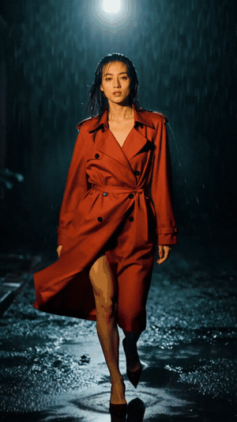
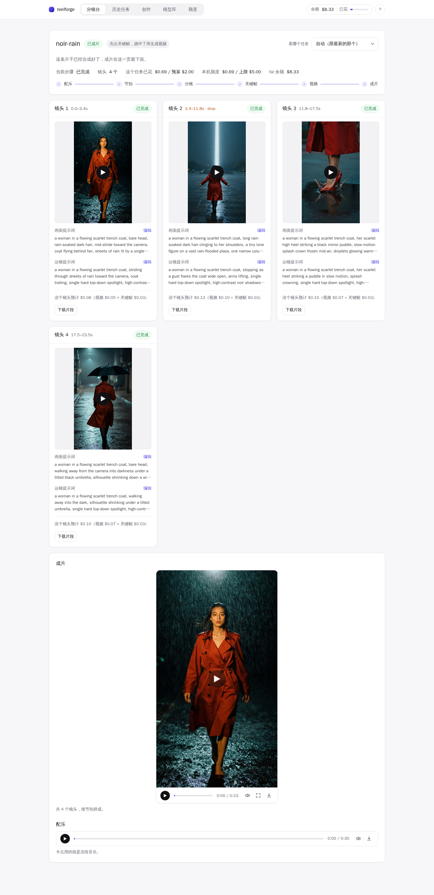

# reelforge

**AI video creation for coding agents.** A short-video pipeline with no fixed
web flow to click through and no API glue to write: a YAML manifest goes in, a
beat-synced reel comes out, and every step in between is a CLI command over
plain files.

Built for agents to run, for humans to approve. Claude Code, Codex or any CLI
agent can start a job, read the storyboard it produced, rewrite a prompt it
doesn't like, regenerate one shot, approve the rest and finish the reel; the
local dashboard is for watching and approving, not for driving. Generation runs
on [fal.ai](https://fal.ai).



*Real output, not a mockup: the opening beat cut of a 30-second reel — MiniMax
H3 (Hailuo) Max Turbo image-to-video at 768P, from the bundled
`jobs/examples/showcase-noir.yaml`. The whole reel — music, four shots, keyframe
drafts, two per-shot redo rounds at the approval gate, video and assembly —
charged $0.69.*



*The same reel on the storyboard board after the run. Each card carries the
shot's exact prompts, per-shot cost and the finished clip playing inline; the
header tracks spend against the job budget and the machine-wide cap. Before
any video money was spent, this run stopped at the approval gate twice — two
shots' prompts were rewritten and redrawn (about a cent per draft) until every
keyframe was worth animating. (The UI is Chinese today.)*

## Why reelforge

Web video tools are shaped around one prompt box and one clip at a time: type,
wait, look, regenerate until something lands. That shape has consequences. The
playgrounds aren't scriptable — the providers do have APIs, but the
orchestration on top (timing, batching, cost control, retries) is left to you,
so ten reels are ten manual sessions. Fixing shot 3 of a six-shot piece means
walking the flow again. The prompt that finally worked lives in a browser tab,
not a file you can diff or reuse. You find out what a session cost only after
you've spent it. And none of it can be handed to the coding agent already open in
your terminal.

reelforge turns the same work into files and commands: a manifest names the music,
the style and the shots, and the pipeline generates music, detects its beat grid,
plans one shot per beat-aligned slot, writes an editable `storyboard.json`, drafts
cheap keyframes, stops for approval, renders video only for approved shots, then
cuts to the beat with ffmpeg.

- **Batch is the default.** A job is a file; ten reels are ten files and a
  loop, on per-clip API pricing rather than a seat subscription.
- **Per-shot control before the money.** A keyframe draft costs about a cent
  (≈$0.01), while a shot's video runs roughly 10x that or more — so the gate
  sits between them: nothing paid happens past a shot you haven't approved.
- **Revise one shot, not the reel.** Edit that shot's prompt and only its
  keyframes regenerate — approved shots, the beat grid and the plan stand.
- **Resumable, with a complete record.** Prompts, choices, costs and clips land
  in `runs/<job>/` as plain files you can diff and reuse, and re-running skips
  completed steps instead of re-charging them. (Video models are stochastic —
  what's reproducible is the record, not the pixels.)
- **Spend is bounded before it happens.** Two hard caps checked before every paid
  call, estimates written down before the spend, every charge in a ledger.
- **Exit codes to branch on.** `0` done, `1` invalid job file or unexpected
  failure, `2` invalid edit, `3` awaiting approval, `4` budget exceeded —
  enough to drive the loop unattended.

## Quickstart

Needs Python 3.12+, [uv](https://docs.astral.sh/uv/), and `ffmpeg`/`ffprobe` on
PATH (assembly, media probing and placeholder synthesis shell out to them).

```bash
uv sync
uv run reelforge run jobs/examples/pet-pov.yaml --dry-run   # stops at the approval gate, exit 3
uv run reelforge run jobs/examples/direct.yaml --dry-run --auto   # straight through to a cut
uv run reelforge dash                                             # http://127.0.0.1:7799
```

`--dry-run` synthesizes local placeholder media instead of calling anything,
and is how the tests (`uv run pytest`) and every smoke run work. Real runs need
a fal key in `.env` at the repo root (`FAL_KEY=...`) or exported.

## Two ways to run a job

**Storyboard-first** (`flow: image-first`, the default) — spend on pictures
before spending on video:

```bash
uv run reelforge run jobs/examples/pet-pov.yaml
# music → beats → shot plan → storyboard.json → keyframe candidates per shot
# exit code 3: shots are waiting for approval

# approve what works, rewrite and redo what doesn't, re-run to continue
uv run reelforge shot jobs/examples/pet-pov.yaml 0 --chosen 2 --approve
uv run reelforge shot jobs/examples/pet-pov.yaml 1 \
    --image-prompt "a golden retriever with a red collar, hard rim light, ..." --redo
uv run reelforge run jobs/examples/pet-pov.yaml        # redoes shot 1, gates again
```

Keyframes are cheap and video is not, so that loop can run as long as it takes;
approved shots become video on the next run. `--auto` skips the gate entirely.

**Direct** (`flow: direct`) — one command from manifest to finished reel,
text-to-video with no keyframe stage and no gate:

```bash
uv run reelforge run jobs/examples/direct.yaml
```

## Job spec

The manifest is the primary interface — everything else reads from it:

```yaml
name: neon-cat-demo        # run directory name (runs/<name>/)
style: neon-street         # prompt recipe: contrast-noir | rim-glow | neon-street | pov-pet | pov-vlog
flow: image-first          # image-first (storyboard gate) | direct (text-to-video)
image_quality: fast        # fast (Z-Image Turbo) | high (Seedream 5 Lite)
resolution: 768P           # video tier: 480P | 768P | 1080P
aspect: "9:16"             # 9:16 | 16:9 | 1:1
budget_usd: 3.0            # per-job cap
n_variants: 3              # keyframe candidates per shot
music:
  prompt: "dark aggressive phonk, 130 bpm, hard-hitting drop"
  duration_s: 30
shots:                     # one entry per shot; subject is the anchor —
  - subject: "a black cat with amber eyes"   # keep it verbatim across shots
    action: "sprinting toward the camera"
    scene: "narrow alley walls streaked with magenta neon"
```

A bad manifest fails at load with the problems listed on stderr and exit code 1.

Two rules hold regardless of flow. **Music first:** the beat grid is the only
timing authority, shot lengths are beat-aligned slots decided before any video
exists, and each clip is generated slightly longer than its slot so the trim
lands on a beat. **Judge ≠ generator:** the model that made a candidate never
picks it — today the pick comes from the driving agent (which can read the
candidate images) or from the human in the dashboard, and built-in rubric
scoring is roadmap, not shipped. Winning prompts accumulate in
`library/prompts.jsonl` as a prompt bank.

## The storyboard contract

After planning, `runs/<job>/storyboard.json` is the single source of truth for
every prompt the job will use. The runner writes it once and never overwrites
it, so edits survive between runs; it reads prompts back when rendering and
records candidates, choices and clips as work completes. Each shot:

```json
{
  "index": 0, "start": 0.0, "end": 11.77, "gen_seconds": 13, "on_drop": false,
  "image_prompt": "...", "video_prompt": "...",
  "est_images_usd": 0.031, "est_video_usd": 0.13,
  "candidates": ["runs/pet-pov-demo/assets/kf_0_a1_0.png", "..."],
  "chosen": null, "video": null, "notes": "", "status": "images_ready"
}
```

`on_drop` marks the shot that lands on the music's drop — it starts at the
track's biggest sustained energy jump, and gets a harder camera move to match.

Status lifecycle: `planned → images_ready → approved → done`, with
`images_ready → redo` when a prompt is edited — a redo regenerates that shot's
keyframes only (to fresh filenames, so nothing serves a stale image) and leaves
approved shots alone. Direct-flow shots skip the image stage entirely.

An agent can edit the file directly, or go through the validating endpoint the
dashboard also uses:

```bash
uv run reelforge shot <job.yaml> <index> \
    [--image-prompt S] [--video-prompt S] [--chosen N] [--approve | --redo] [--notes S]
```

It prints the updated shot as JSON. Bad edits are rejected at write time rather
than at spend time — unknown fields, empty or lint-failing prompts, a `chosen`
index that doesn't exist, approving a shot with nothing chosen — with the reason
on stderr and exit code 2. `uv run reelforge status <job.yaml>` prints the run
state plus a one-line summary per shot.

## Dashboard

`uv run reelforge dash` serves a local console on 127.0.0.1: the plan the agent
made and everything being generated, live, plus controls to pick keyframes,
adjust spend limits or try a model in the playground. The UI is Chinese-first
today. The CLI never needs it — the two are views on the same files.

## Cost controls

Two hard caps are checked before every paid call:

- `budget_usd` per job in the manifest — the run stops with exit code 4 rather
  than exceed it;
- a machine-wide cap in `runs/limits.json`, covering every job and every
  playground call, editable from the dashboard.

Alongside them, estimates are computed before the spend — per-shot
`est_images_usd` / `est_video_usd` in the storyboard, a whole-job estimate on
the dashboard — and the record is `runs/ledger.jsonl`, every charge,
append-only (per-run spend sits in that run's `state.json`). For scale: at the
480P/768P defaults a 30-second reel estimates around $0.5–$2 depending on model
and resolution (1080P and the higher-end image models run above that), and
every run prints its own estimate before anything is spent.

## Models and providers

`src/reelforge/models_catalog.py` holds every endpoint id, price and cost
estimator in one file, with the pipeline's defaults in `config.py`. Runnable
today: Z-Image Turbo, FLUX 2, Nano Banana and Seedream 5 Lite for images; H3
Max Turbo, H3 Max, Seedance 1.5 Pro and Seedance 2.5 for video; MiniMax Music 3
and ElevenLabs Music for audio — the rest of the catalog is display-only until
its adapter lands. Adding or changing a model means checking its slug and schema
against fal's public OpenAPI
(`https://fal.ai/api/openapi/queue/openapi.json?endpoint_id=<slug>`); the catalog
records when that check last ran — the method used, not a standing guarantee.

fal is not baked in: `generate.py` is the only file that knows how media gets
made and `fal.py` is pure transport, so another backend only has to implement
`gen_image`, `gen_video` and `gen_music`. A self-hosted path (H3 open weights on
a rented GPU via ComfyUI) is roadmap intent — no alternative backend ships today.

## Prompt recipes

`src/reelforge/promptcraft.py` builds prompts from published guidance rather
than vibes: subject-first ordering with one hard light source and plain-word
chromatic contrast ([Hailuo visual-contrast guide](https://hailuoai.video/pages/knowledge/visual-contrast-ai-video-subjects-guide)),
lens terms to mask generation noise, an identical 5–7 word subject anchor
across a sequence, and — for POV formats — stating where the camera is
physically mounted instead of saying "POV"
([viral AI vlog teardown](https://trending.knowyourmeme.com/editorials/guides/what-are-the-ai-bigfoot-and-yeti-vlogs-and-how-are-people-making-them-the-viral-ai-video-trend-on-tiktok-explained)).
A lint step rejects a fixed list of vague filler words (the list lives in
`promptcraft.py`), in generated and hand-edited prompts alike.

## Roadmap

- Dance/motion-transfer job kind (Wan Animate / Wan-Dancer)
- Unattended vision scoring, so an agent can approve keyframes on a rubric
- Video-stage review: sample frames from draft clips, re-render the winner
- ComfyUI backend for self-hosted H3

## License

MIT
